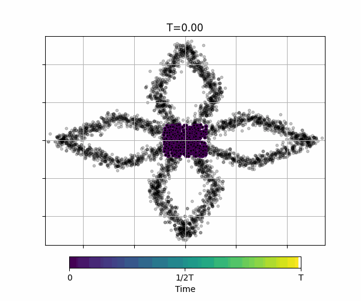
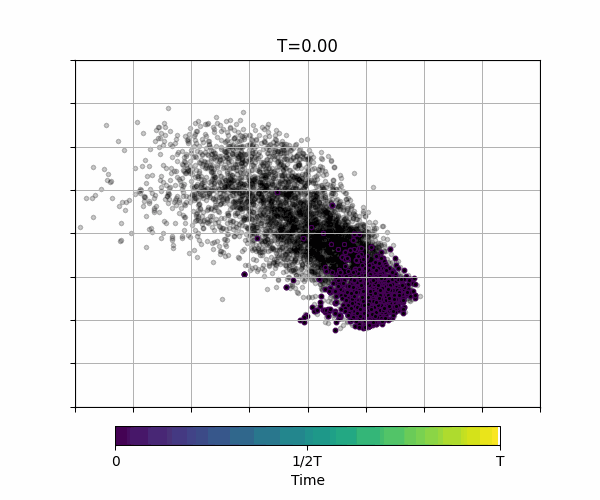

<h1 align='center'>Multi-Marginal Schrödinger Bridge Matching (MSBM)</h1>
<div align="center">
  <a href="https://bw-park.github.io/" target="_blank">Byoungwoo Park</a><sup>1</sup>&ensp;<b>&middot;</b>&ensp;
  <a href="https://juho-lee.github.io/" target="_blank">Juho Lee</a><sup>1</sup><br>
  <sup>1</sup>KAIST <br>
</div>
<br>

In Multi-Marginal Schrödinger Bridge Matching (MSBM), we extend IMF algorithm into multi-marginal case and efficient (temporally parallel) learning algorithm.

## Examples
| Tasks (`--problem-name`)      | Results|
|-------------------------      |-------------------------|
| Petal (`Petal`)               | <p float="left">   </p> |
| RNA sequence (`RNAsc`)        | <p float="left">   </p> |

## Installation
This code is developed with Python3 and Pytorch. To set up an environment with the required packages,
1. Create a virtual environment, for example:
```
conda create -n MSBM python=3.10
conda activate MSBM
```
2. Install Pytorch according to the [official instructions](https://pytorch.org/get-started/locally/).
3. Install the requirements:
```
pip install -r requirements.txt
```

## Training and Evaluation
- To train and evaluate an MSBM, use the command below
```
python main.py --problem_name <PROBLEM_NAME>
```
- with **PROBLEM_NAME** is the tasks such as `semicircle`, `Petal`, `hesc`, `RNA5dim`.
- For Leave-one-out experiment including `cite5`, `multi5`, `cite100`, `multi100`, `RNAsc`, use the command below
```
python main.py --problem_name <PROBLEM_NAME> --LOO 1
```
```
python main.py --problem_name <PROBLEM_NAME> --LOO 2
```

You can find more details about other configurations in `options.py`, and default settings for each task are available in `configs`.


# Acknowledgements
Our code builds upon an outstanding open source projects and papers:
* [Deep Momentum Multi-Marginal Schrödinger Bridge](https://github.com/TianrongChen/DMSB).